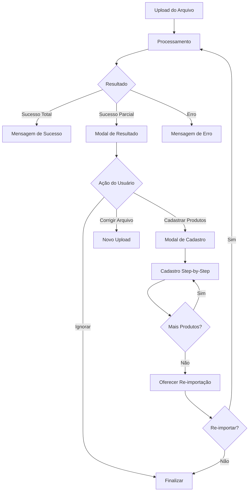

# Nova Funcionalidade de Importação com Tratamento de Produtos Não Encontrados

## 📋 Visão Geral

Esta implementação adiciona um fluxo completo para lidar com situações onde produtos não são encontrados durante a importação de movimentações, permitindo que o usuário cadastre esses produtos e reimporte os dados.

## 🚀 Principais Features Implementadas

### 1. **Nova Estrutura de Resposta da API**

#### Para Movimentações:
```typescript
interface ImportMovimentacoesResponse {
  movimentacoesImportadas: number
  movimentacoesIgnoradas: number
  mensagem: string
  produtosNaoEncontrados: ProdutoNaoEncontrado[]
}
```

#### Para Produtos:
```typescript
interface ImportProdutosResponse {
  produtosImportados: number
  mensagem: string
}
```

### 2. **Estados da Interface**

- **Sucesso Total**: Todas as movimentações foram importadas
- **Sucesso Parcial**: Algumas movimentações foram ignoradas devido a produtos não encontrados
- **Erro**: Falha na importação

### 3. **Componentes Principais**

#### `ImportResultDialog`
- Modal que exibe o resultado da importação
- Lista produtos não encontrados em uma tabela
- Permite seleção múltipla de produtos para cadastro
- Oferece opções de ação: Cadastrar, Ignorar, ou Corrigir Arquivo

#### `QuickProductRegistration`
- Modal de cadastro rápido de produtos
- Formulário step-by-step para cada produto selecionado
- Progress bar mostrando andamento do cadastro
- Pré-preenchimento do nome do produto
- Campos para categoria, preço, custo, descrição e quantidade inicial

### 4. **Fluxo de Importação Atualizado**



## 🎯 Funcionalidades Detalhadas

### **1. Tratamento de Produtos Não Encontrados**

- **Detecção**: A API retorna lista de produtos não encontrados
- **Visualização**: Tabela com detalhes de cada produto (linha, quantidade, data, tipo)
- **Seleção**: Checkbox para seleção individual ou em massa
- **Ações**: Múltiplas opções para o usuário escolher

### **2. Cadastro Rápido de Produtos**

- **Interface Step-by-Step**: Um produto por vez
- **Progress Tracking**: Barra de progresso visual
- **Formulário Inteligente**: 
  - Nome pré-preenchido
  - Categoria mantida entre produtos
  - Validações em tempo real
- **Flexibilidade**: Opção de pular produtos ou cancelar

### **3. Re-importação Inteligente**

- **Confirmação**: Pergunta ao usuário se deseja tentar novamente
- **Contexto Preservado**: Mantém arquivo selecionado para re-importação
- **Feedback Claro**: Mostra quantos produtos foram cadastrados

### **4. Estados Visuais Aprimorados**

- **Loading States**: Spinners e progress bars
- **Status Indicators**: Badges coloridos para tipos de movimentação
- **Alertas Contextuais**: Diferentes cores para sucesso, aviso e erro
- **Feedback Imediato**: Toasts para todas as ações

## 📁 Estrutura de Arquivos

```
/types/
  └── import.ts                    # Tipos TypeScript para importação

/components/
  ├── import-result-dialog.tsx     # Modal de resultado da importação
  └── quick-product-registration.tsx # Modal de cadastro rápido

/app/importar-dados/
  └── page.tsx                     # Página principal (atualizada)

/lib/
  └── api.ts                       # API atualizada para nova resposta
```

## 🔧 Configuração e Uso

### **1. Tipos de Arquivo Suportados**
- Excel (.xlsx, .xls)
- CSV (.csv)
- Tamanho máximo: 10MB

### **2. Validações Implementadas**
- Verificação de formato de arquivo
- Validação de tamanho
- Campos obrigatórios no formulário de cadastro

### **3. Compatibilidade**
- Mantém compatibilidade com API antiga (string response)
- Detecta automaticamente formato de resposta (JSON vs texto)

## 🎨 UX/UI Melhorias

### **Feedback Visual**
- **Cores Semânticas**: Verde (sucesso), Amarelo (parcial), Vermelho (erro)
- **Ícones Intuitivos**: Checkmarks, warnings, etc.
- **Progress Indicators**: Barras de progresso e contadores

### **Interações Fluídas**
- **Seleção em Massa**: "Selecionar todos" com um clique
- **Navegação Step-by-Step**: Próximo/Anterior/Pular
- **Confirmações Inteligentes**: Confirmação antes de ações irreversíveis

### **Responsividade**
- **Mobile-First**: Funciona em todos os tamanhos de tela
- **Tabelas Responsivas**: Scroll horizontal em telas pequenas
- **Modais Adaptativos**: Tamanho baseado no conteúdo

## 📱 Casos de Uso

### **Caso 1: Importação com Produtos Faltantes**
1. Usuário faz upload do arquivo
2. Sistema identifica produtos não encontrados
3. Modal mostra lista de produtos faltantes
4. Usuário seleciona produtos para cadastrar
5. Cadastro step-by-step
6. Opção de re-importar arquivo

### **Caso 2: Correção de Arquivo**
1. Usuário vê produtos não encontrados
2. Escolhe "Corrigir Arquivo"
3. Edita planilha externamente
4. Faz novo upload com dados corrigidos

### **Caso 3: Ignorar Produtos**
1. Usuário decide não cadastrar produtos faltantes
2. Escolhe "Ignorar e Continuar"
3. Importação é finalizada com dados parciais

## 🧪 Como Testar

### **1. Teste de Sucesso Total**
- Crie arquivo com produtos existentes
- Verifique mensagem de sucesso

### **2. Teste de Sucesso Parcial**
- Crie arquivo com mix de produtos (existentes + não existentes)
- Verifique modal de resultado
- Teste cadastro de produtos
- Teste re-importação

### **3. Teste de Erro**
- Use arquivo com formato inválido
- Verifique mensagem de erro

## 🔮 Próximas Melhorias

1. **Preview do Arquivo**: Mostrar primeiras linhas antes do upload
2. **Validação Prévia**: Verificar produtos antes da importação
3. **Histórico de Importações**: Log de todas as importações realizadas
4. **Templates Dinâmicos**: Templates baseados em produtos existentes
5. **Importação em Lote**: Múltiplos arquivos simultaneamente

## 📞 Suporte

Para dúvidas ou problemas com a implementação, consulte:
- Documentação da API do backend
- Logs do console do navegador
- Network tab para debug de requisições
